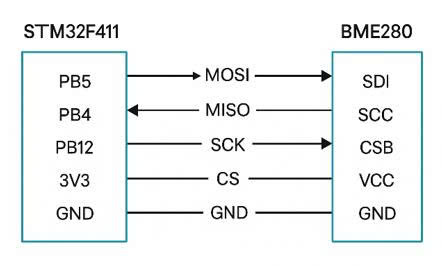
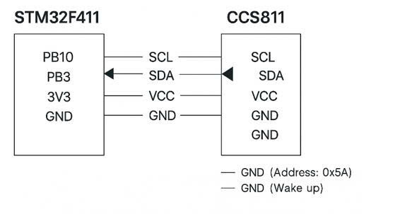
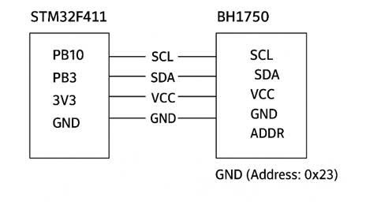
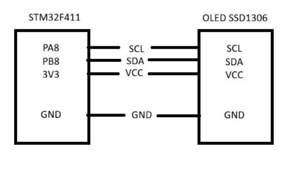
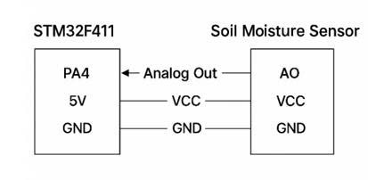
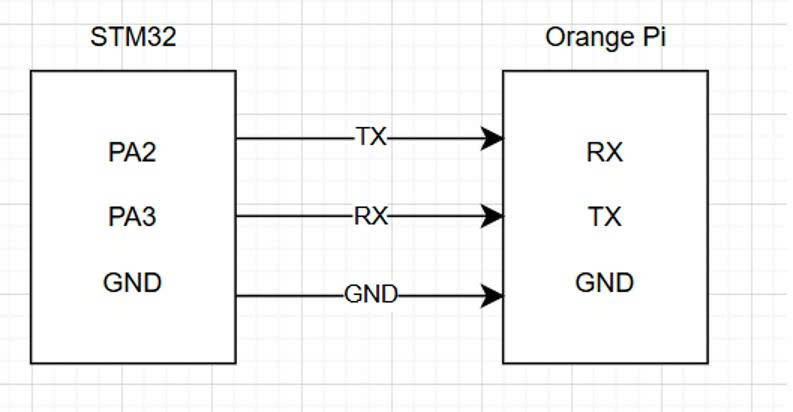

# STM32 Environmental Monitoring System with FreeRTOS

A comprehensive environmental monitoring system built with STM32 microcontroller, integrating multiple sensors (BME280, CCS811, BH1750) and display modules (OLED) using FreeRTOS for real-time task management.

## Features

- **Temperature & Humidity Monitoring** - BME280 sensor
- **Air Quality Monitoring** - CCS811 sensor (eCO2 and TVOC)
- **Light Intensity Measurement** - BH1750 sensor
- **OLED Display** - Real-time data visualization
- **SMS Notifications** - Alert system for environmental thresholds
- **OPI Integration** - Extended connectivity options
- **FreeRTOS** - Real-time operating system for efficient task management

## Hardware Components

- STM32 Microcontroller
- BME280 - Temperature, Humidity, and Pressure Sensor
- CCS811 - Air Quality Sensor (eCO2 and TVOC)
- BH1750 - Ambient Light Sensor
- OLED Display (I2C/SPI)
- SMS Module
- OPI Module

## Hardware Design Images

### STM32 with BME280 Sensor


### STM32 with CCS811 Sensor


### STM32 with BH1750 Light Sensor


### STM32 with OLED Display


### STM32 with SMS Module


### STM32 with OPI Module


## Code Examples

### Sensor Initialization

#### BME280 Sensor Initialization
```c
// BME280 I2C initialization
void BME280_Init(void) {
    uint8_t config_data;
    
    // Configure BME280 settings
    config_data = (BME280_STANDBY_TIME_1000_MS << 5) | 
                  (BME280_FILTER_COEFF_16 << 2);
    HAL_I2C_Mem_Write(&hi2c1, BME280_I2C_ADDR, 
                      BME280_REG_CONFIG, 1, &config_data, 1, HAL_MAX_DELAY);
    
    // Set oversampling and power mode
    config_data = (BME280_OVERSAMP_16X << 5) | 
                  (BME280_OVERSAMP_16X << 2) | 
                  BME280_NORMAL_MODE;
    HAL_I2C_Mem_Write(&hi2c1, BME280_I2C_ADDR, 
                      BME280_REG_CTRL_MEAS, 1, &config_data, 1, HAL_MAX_DELAY);
}

// Read temperature from BME280
float BME280_ReadTemperature(void) {
    uint8_t data[3];
    int32_t adc_T;
    
    HAL_I2C_Mem_Read(&hi2c1, BME280_I2C_ADDR, 
                     BME280_REG_TEMP, 1, data, 3, HAL_MAX_DELAY);
    
    adc_T = ((int32_t)data[0] << 12) | ((int32_t)data[1] << 4) | 
            ((int32_t)data[2] >> 4);
    
    return BME280_CompensateTemperature(adc_T);
}
```

#### CCS811 Air Quality Sensor
```c
// CCS811 initialization
void CCS811_Init(void) {
    uint8_t app_start = 0xF4;
    uint8_t meas_mode = 0x10; // Drive mode 1 (1 second intervals)
    
    // Start application mode
    HAL_I2C_Master_Transmit(&hi2c1, CCS811_I2C_ADDR, 
                           &app_start, 1, HAL_MAX_DELAY);
    HAL_Delay(10);
    
    // Configure measurement mode
    HAL_I2C_Mem_Write(&hi2c1, CCS811_I2C_ADDR, 
                      CCS811_REG_MEAS_MODE, 1, &meas_mode, 1, HAL_MAX_DELAY);
}

// Read air quality data
void CCS811_ReadData(uint16_t *eCO2, uint16_t *TVOC) {
    uint8_t data[8];
    
    HAL_I2C_Mem_Read(&hi2c1, CCS811_I2C_ADDR, 
                     CCS811_REG_ALG_RESULT_DATA, 1, data, 8, HAL_MAX_DELAY);
    
    *eCO2 = (data[0] << 8) | data[1];
    *TVOC = (data[2] << 8) | data[3];
}
```

#### BH1750 Light Sensor
```c
// BH1750 initialization
void BH1750_Init(void) {
    uint8_t power_on = 0x01;
    uint8_t continuous_mode = 0x10; // Continuous H-Resolution Mode
    
    HAL_I2C_Master_Transmit(&hi2c1, BH1750_I2C_ADDR, 
                           &power_on, 1, HAL_MAX_DELAY);
    HAL_Delay(10);
    
    HAL_I2C_Master_Transmit(&hi2c1, BH1750_I2C_ADDR, 
                           &continuous_mode, 1, HAL_MAX_DELAY);
}

// Read light intensity
float BH1750_ReadLight(void) {
    uint8_t data[2];
    uint16_t lux;
    
    HAL_I2C_Master_Receive(&hi2c1, BH1750_I2C_ADDR, 
                          data, 2, HAL_MAX_DELAY);
    
    lux = (data[0] << 8) | data[1];
    return lux / 1.2; // Convert to lux
}
```

### FreeRTOS Task Implementation

```c
// Sensor reading task
void SensorTask(void *pvParameters) {
    float temperature, humidity, pressure;
    uint16_t eCO2, TVOC;
    float light_intensity;
    
    TickType_t xLastWakeTime = xTaskGetTickCount();
    const TickType_t xFrequency = pdMS_TO_TICKS(1000); // 1 second
    
    while(1) {
        // Read BME280 data
        temperature = BME280_ReadTemperature();
        humidity = BME280_ReadHumidity();
        pressure = BME280_ReadPressure();
        
        // Read CCS811 data
        CCS811_ReadData(&eCO2, &TVOC);
        
        // Read BH1750 data
        light_intensity = BH1750_ReadLight();
        
        // Update display
        xQueueSend(displayQueue, &sensorData, portMAX_DELAY);
        
        // Check thresholds and send alerts if needed
        CheckThresholds(temperature, humidity, eCO2);
        
        vTaskDelayUntil(&xLastWakeTime, xFrequency);
    }
}

// Display update task
void DisplayTask(void *pvParameters) {
    SensorData_t data;
    
    while(1) {
        if(xQueueReceive(displayQueue, &data, portMAX_DELAY) == pdTRUE) {
            OLED_Clear();
            OLED_SetCursor(0, 0);
            OLED_Printf("Temp: %.1f C", data.temperature);
            OLED_SetCursor(0, 1);
            OLED_Printf("Hum: %.1f%%", data.humidity);
            OLED_SetCursor(0, 2);
            OLED_Printf("eCO2: %d ppm", data.eCO2);
            OLED_SetCursor(0, 3);
            OLED_Printf("Light: %.0f lux", data.light);
            OLED_Display();
        }
    }
}

// SMS alert task
void SMSTask(void *pvParameters) {
    AlertMessage_t alert;
    
    while(1) {
        if(xQueueReceive(alertQueue, &alert, portMAX_DELAY) == pdTRUE) {
            SMS_SendAlert(alert.message);
        }
    }
}
```

### OLED Display Functions

```c
// OLED initialization
void OLED_Init(void) {
    uint8_t init_sequence[] = {
        0xAE, // Display off
        0xD5, 0x80, // Set display clock
        0xA8, 0x3F, // Set multiplex ratio
        0xD3, 0x00, // Set display offset
        0x40, // Set start line
        0x8D, 0x14, // Enable charge pump
        0x20, 0x00, // Set memory mode
        0xA1, // Set segment remap
        0xC8, // Set COM output scan direction
        0xDA, 0x12, // Set COM pins
        0x81, 0xCF, // Set contrast
        0xD9, 0xF1, // Set pre-charge period
        0xDB, 0x40, // Set VCOMH
        0xA4, // Display follows RAM
        0xA6, // Normal display
        0xAF  // Display on
    };
    
    for(int i = 0; i < sizeof(init_sequence); i++) {
        OLED_WriteCommand(init_sequence[i]);
    }
    
    OLED_Clear();
}

// Display sensor data on OLED
void OLED_DisplaySensorData(SensorData_t *data) {
    char buffer[32];
    
    OLED_Clear();
    
    sprintf(buffer, "T: %.1fC H: %.1f%%", data->temperature, data->humidity);
    OLED_DrawString(0, 0, buffer, FONT_SIZE_SMALL);
    
    sprintf(buffer, "P: %.0f hPa", data->pressure);
    OLED_DrawString(0, 16, buffer, FONT_SIZE_SMALL);
    
    sprintf(buffer, "eCO2: %d ppm", data->eCO2);
    OLED_DrawString(0, 32, buffer, FONT_SIZE_SMALL);
    
    sprintf(buffer, "TVOC: %d ppb", data->TVOC);
    OLED_DrawString(0, 48, buffer, FONT_SIZE_SMALL);
    
    OLED_Update();
}
```

### Main Application Setup

```c
int main(void) {
    // HAL initialization
    HAL_Init();
    SystemClock_Config();
    
    // Initialize peripherals
    MX_GPIO_Init();
    MX_I2C1_Init();
    MX_USART1_UART_Init();
    
    // Initialize sensors
    BME280_Init();
    CCS811_Init();
    BH1750_Init();
    OLED_Init();
    
    // Create FreeRTOS queues
    displayQueue = xQueueCreate(5, sizeof(SensorData_t));
    alertQueue = xQueueCreate(5, sizeof(AlertMessage_t));
    
    // Create FreeRTOS tasks
    xTaskCreate(SensorTask, "Sensor", 256, NULL, 2, NULL);
    xTaskCreate(DisplayTask, "Display", 256, NULL, 2, NULL);
    xTaskCreate(SMSTask, "SMS", 256, NULL, 1, NULL);
    
    // Start scheduler
    vTaskStartScheduler();
    
    // Should never reach here
    while(1);
}
```

## Pin Configuration

### I2C Connections
- **SCL**: PB6
- **SDA**: PB7

### Sensor Addresses
- BME280: 0x76 or 0x77
- CCS811: 0x5A or 0x5B
- BH1750: 0x23 or 0x5C
- OLED: 0x3C or 0x3D

### UART (SMS Module)
- **TX**: PA9
- **RX**: PA10

## Software Requirements

- STM32CubeIDE or Keil MDK
- STM32 HAL Library
- FreeRTOS
- ARM GCC Toolchain

## Installation & Setup

1. Clone the repository:
```bash
git clone https://github.com/n22dcdt066-toan/STM32-BME280-CCS811-CBDAD-OLED-PREERTOS.git
```

2. Open the project in STM32CubeIDE

3. Configure the I2C and UART peripherals using STM32CubeMX

4. Build and flash to your STM32 device

## Usage

1. Power on the system
2. The OLED display will show real-time sensor readings
3. SMS alerts will be sent when environmental thresholds are exceeded
4. Monitor data through the OPI interface for remote access

## Threshold Configuration

Modify the threshold values in `config.h`:

```c
#define TEMP_THRESHOLD_HIGH     35.0  // °C
#define TEMP_THRESHOLD_LOW      10.0  // °C
#define HUMIDITY_THRESHOLD_HIGH 80.0  // %
#define CO2_THRESHOLD           1000  // ppm
#define TVOC_THRESHOLD          500   // ppb
```

## Contributing

Contributions are welcome! Please feel free to submit a Pull Request.

## License

This project is licensed under the MIT License - see the LICENSE file for details.

## Author

**n22dcdt066-toan**

## Acknowledgments

- STM32 HAL Library
- FreeRTOS
- Bosch BME280 Driver
- AMS CCS811 Driver
- ROHM BH1750 Driver

---

*Last Updated: 2026-01-06*
